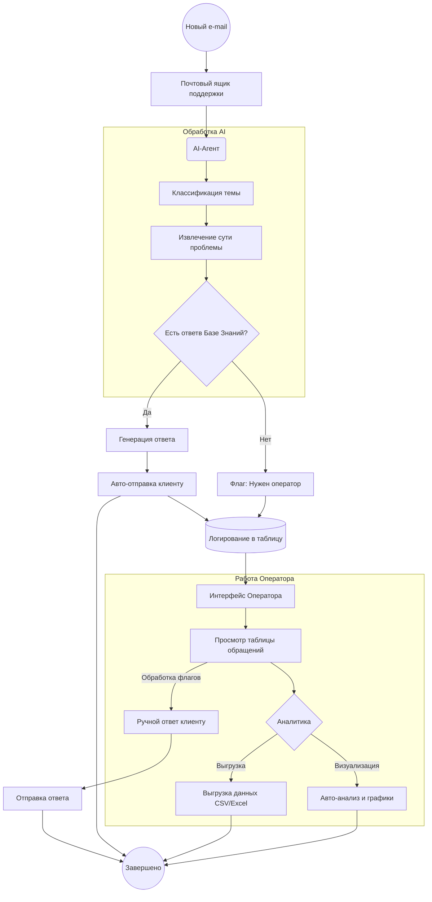
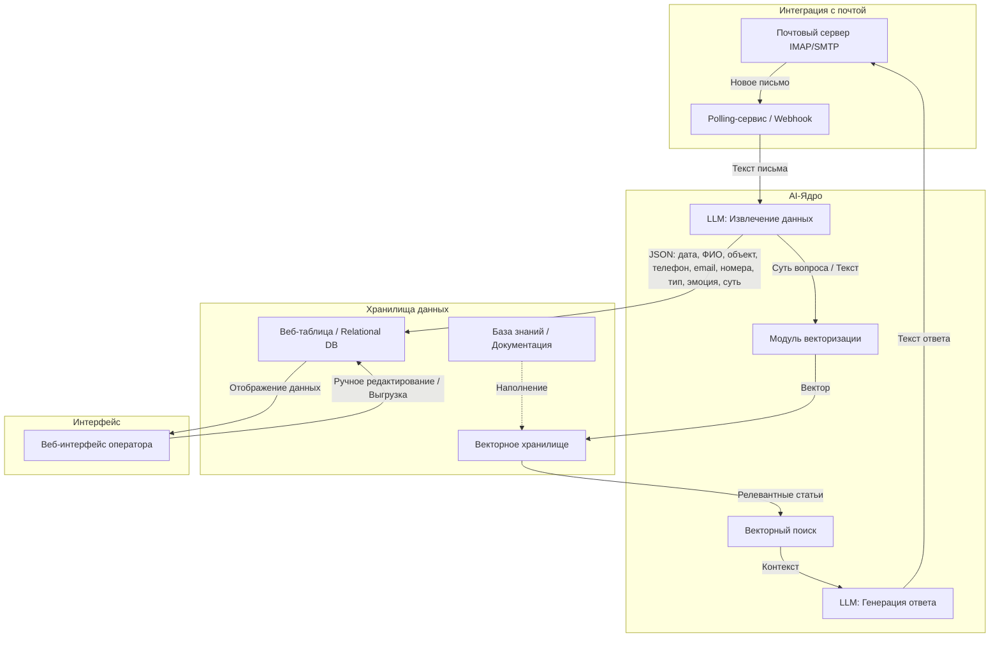

# Как развернуть
Клонируем репо: 
```
git clone https://github.com/marcuryyy/funny_snake.git
```

Заходим в папку с docker-compose файлом:
```
cd ./funny_snake/docker-images
```

Запускаем билд и сервисы:
```
docker compose up -d --build
```

Сайт должен быть доступен по ```localhost:80```

# Идейная реализация решения
Пользовательский путь (User Flow)
1. Система получает новые обращения из почтового ящика поддержки.
2. AI-агент классифицирует тему обращения, извлекает суть проблемы и остальные признаки, генерирует ответ и отправляет его.
3. Оператор просматривает таблицу, имеет возможность выгрузить данные для дальнейшей аналитики или запустить автоматический анализ (визуализация данных прямо в интерфейсе)
4. Оператор при необходимости сам отвечает клиентам по обращениям (LLM не нашла ответ в базе знаний)
   

# Архитектура системы
Решение строится по модульному принципу:
* Polling-сервис или Webhook, подключенный к почтовому API (IMAP/SMTP).
* LLM-модель, которая получает промпт с контекстом (текст письма + релевантные статьи из базы знаний) и возвращает структурированный JSON с полями.
* Векторное хранилище, содержащее документацию, ответы на часто задаваемые вопросы и т.д.
* Простая веб-таблица с извлеченными данными и возможностью ручного ввода новых данных, кнопкой для выгрузки данных. Также предполагается возможность автоматического анализа.

Взаимодействие происходит следующим образом:
1. При помощи Polling-сервис или Webhook, получаем письмо и извлекаем из него текст.
2. Затем этот текст (возможно, с некоторым кол-вом примеров) отправляется в LLM для извлечения необходимой информации. Вывод LLM на данном шаге - JSON с полями таблицы (дата, фио, объект, телефон, email, заводские номера, тип приборов, эмоциональный окрас, суть вопроса). Поля JSON записываются в веб-таблицу. 
3. Далее векторизуем поле "суть вопроса" или весь текст письма. Ищем в векторной базе данных релевантную информацию при помощи векторного поиска.
4. На основе найденной информации ЛЛМ генерирует ответ.
   

# Анализ рисков и план минимизации
* Нехватка времени на разработку полноценного UI - Сделать упор на функциональность бэкенда (ведь с дизайном можно разобраться и позже, главное показать как это работает)
* Не совсем понятен результат векторного поиска (если в качестве вектора брать поле "суть вопроса" / весь текст письма). На сколько качественно будет выбираться релевантная информация. На это все нужно много времени для теста, поэтому в рамках хакатона все варианты проверить крайне трудно. В планах минимизации использовать те модели, которые мы уже применяли в работе и они показывали хорошие результаты + проведение нескольких экспериментов.
* Галлюцинации LLM - В промпте мы ограничим LLM: отвечать только по контексту. Если информации нет - писать "Нужен человек". Для точности еще можно делать дополнительную проверку ответа, прогнав вопрос пользователя и ответ повторно через LLM.


